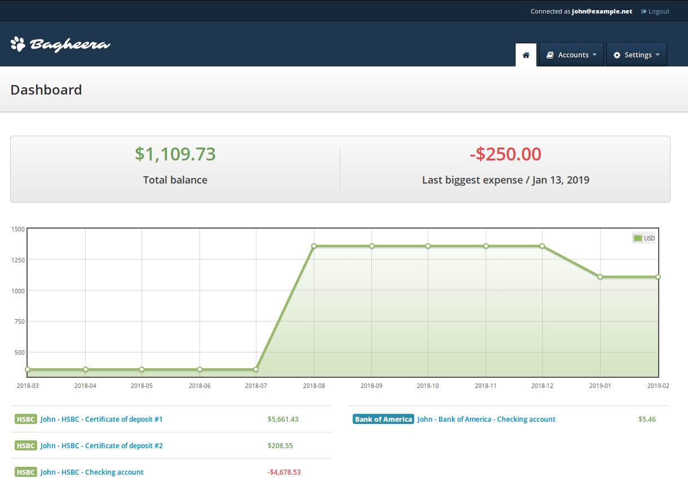

    
    
A personal finance manager

    

        
        
    

## Install on a local computer
- Copy `.docker/.docker-compose.env.dist` to `.docker/.docker-compose.env` and edit values
- Execute `make docker-start ENV=<env>` (ENV=dev by default)

## Install on a server
- Install Ansible
- Run provisioning `ansible-playbook .ansible/provision.yml`
- Copy `.docker/.docker-compose.env.dist` to `.docker/.docker-compose.env` and edit values
- Execute `make docker-start ENV=<env>` (ENV=dev by default)
